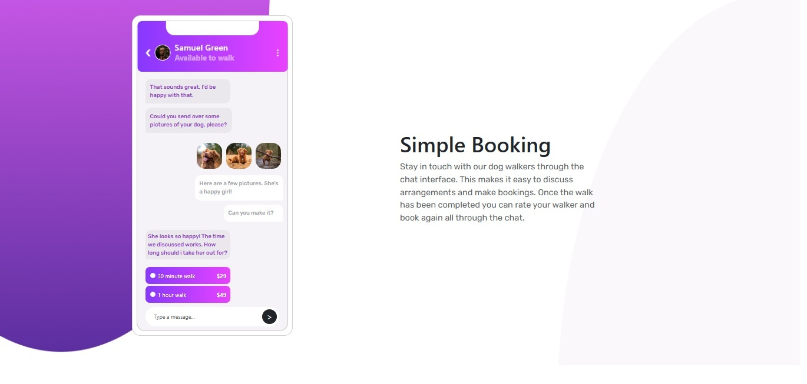

# Frontend Mentor - Chat app CSS illustration solution

This is a solution to the [Chat app CSS illustration challenge on Frontend Mentor](https://www.frontendmentor.io/challenges/chat-app-css-illustration-O5auMkFqY). Frontend Mentor challenges help you improve your coding skills by building realistic projects.

## Table of contents

- [Overview](#overview)
  - [The challenge](#the-challenge)
  - [Screenshot](#screenshot)
  - [Links](#links)
- [My process](#my-process)
  - [Built with](#built-with)
  - [What I learned](#what-i-learned)
  - [Continued development](#continued-development)
  - [Useful resources](#useful-resources)
  - [AI Collaboration](#ai-collaboration)
- [Author](#author)
- [Acknowledgments](#acknowledgments)

## Project Overview

This project is based on the Chat App Bootstrap Illustration challenge from Frontend Mentor. The design represents a simple chat interface that allows users to communicate with a dog walker and schedule walking sessions for their dogs. The Chat APP UI shows a mobile chat screen with a conversation between the user and the dog walker. It includes profile information, chat, and booking options for dog walks.

Challenge link:
[https://www.frontendmentor.io/challenges/chat-app-css-illustration-O5auMkFqY](https://www.frontendmentor.io/challenges/chat-app-css-illustration-O5auMkFqY)

The goal of this project  to practice building a responsive layout using HTML, CSS, and Bootstrap, while focusing on positioning, grids, flex layouts, and responsive design.

### Screenshot

## Approach and Implementation

The layout was built using Bootstrap’s grid system and utility classes. The page has a background image and is divided into two main sections: Left side: The chat app interface displayed inside a card layout. Right side: The text section describing the service (“Simple Booking”).

Bootstrap classes such as container, row, col-md-6, and d-flex were used to structure and align the layout. In certain places like customized webpage background color, app background, gradients background elements and navbar avatar border, instead of bootstrap regular CSS is used. Bootstrap utility classes were used where possible to maintain consistency with the framework. The layout utilities are container, row, col-12, col-md-6, few of the flex box unitlities d-flex, flex-column, justify-content-center, justify-content-between, align-items-center. The other utilities used are spacing utilities(p-2, p-3 etc), Position Utilites, borders and radius, text utilites (text-center, text-muted etc.,) and also h-100, min-vh-100.

## Responsive Design

The layout adjusts across screen sizes using Bootstrap’s responsive column classes: col-12 for mobile (stacked layout), col-md-6 for tablet and desktop (two-column layout).

## What I Learned

Through this project, I practiced building responsive layouts using Bootstrap grid and utility classes**. I learned how to structure the layout properly using `container`, `row`, and `col` so that elements align correctly across screen sizes. I also practiced using flex utilities such as `d-flex`, `align-items-center`, and `justify-content-between` to control alignment and spacing without writing much custom CSS.

Another key learning was **positioning elements using `position-relative` and `position-absolute`** to create the overlay chat header on top of the card.

This project also helped me understand how to combine Bootstrap utilities with custom CSS when more precise styling was required, such as gradients, avatar borders, and chat UI details.

## Acknowledgments

[https://stackoverflow.com/questions/65478047/make-a-rounded-bootstrap-container-or-image-more-rounded-i-e-increase-rounded](https://stackoverflow.com/questions/65478047/make-a-rounded-bootstrap-container-or-image-more-rounded-i-e-increase-rounded)

## Challenges Faced

During development, a few layout challenges were encountered.

1. Bootstrap Grid Structure
   At first, some columns were placed outside the row container, which caused elements to appear below each other instead of side-by-side. This was resolved by ensuring all .col-* elements were placed inside the same .row.
2. Overlay Card Positioning
   The chat header needed to overlay on top of the chat card. This required using position-relative on the card container and position-absolute for the overlay element.
3. Spacing and Alignment
   Aligning the chevron, avatar, user name, and status text inside the overlay required using flex utilities such as: d-flex, align-items-center, justify-content-between, margin and padding utilities
4. Placing the Chat UI to the right of the screen

## Reflections

### Challenges

Challenge 1: During this project, one of the main challenges was structuring the layout correctly using the Bootstrap grid system. Initially, some column elements were placed outside the `row` container, which caused the card and the text content to appear one below the other instead of side by side.

Solution: This was resolved by restructuring the layout so that both columns were placed inside the same `row`.

Challenge 2: Positioning the overlay chat purple header on top of the chat card. The header needed to stay attached to the top of the card without creating a gap.

Solution: This challenge required understanding how to combine `position-relative` on the parent container with `position-absolute` on the overlay element. Used trial and erroa method adjusting spacing inside the overlay using padding and flex utilities.

Challege 3: The Chat UI was sticking to the left side of the screen. Used `justify-content-end mb-4 pe-5`. It is still working.
Solution: I tired the trial and error method. I used `justify-content-center`  at the container level and not at the card level. It worked.

### Improvements if time permits

If given more time, I would improve the project by refining the chat interface design further, adding more realistic chat message components, and improving accessibility. I would also reduce the amount of inline styling and move more styling into reusable CSS classes for better maintainability.
